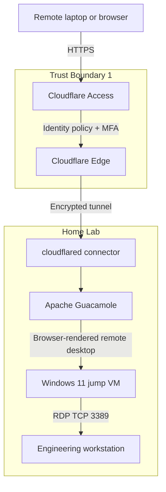
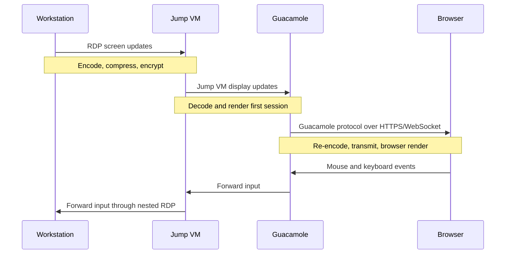
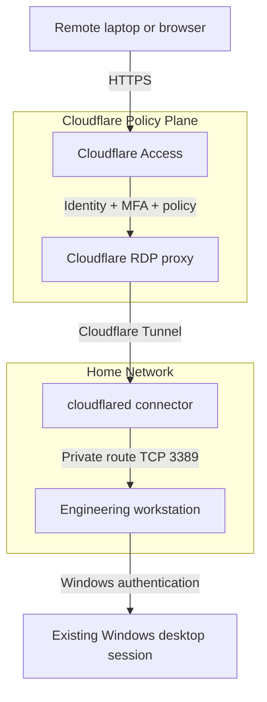
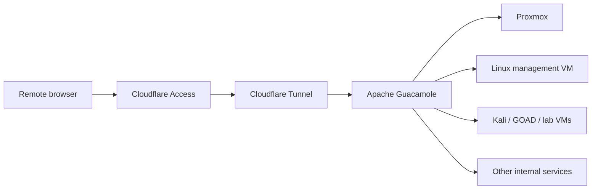

# Tunnel-in-a-Tunnel: Engineering Secure Remote Access Without Exposing RDP

> **Engineering objective:** Provide reliable access to a home engineering workstation and lab from unmanaged or remote locations without forwarding TCP/3389 through the home firewall.

## Executive summary

The first implementation prioritized security and universal browser access:

```text
Remote endpoint
    ↓
Cloudflare Access
    ↓
Cloudflare Tunnel
    ↓
cloudflared connector
    ↓
Apache Guacamole
    ↓
Windows jump VM
    ↓
Windows RDP
    ↓
Engineering workstation
```

The design met its security objectives. It exposed no inbound RDP port, placed identity and MFA checks at the edge, and kept the workstation behind an outbound-only tunnel. It also created two remote-display layers in series. The workstation rendered into an RDP session, the jump VM displayed that session, and Guacamole rendered the jump VM again into HTML5 for the browser.

The result was secure but visibly slow. Typing was acceptable, but mouse movement, window redraw, scrolling, and video were affected by the accumulated cost of protocol translation, compression, encryption, buffering, and repeated screen encoding.

The architecture was therefore refined:

```text
Remote endpoint
    ↓
Cloudflare Access
    ↓
Cloudflare Tunnel
    ↓
Cloudflare browser-based RDP
    ↓
Engineering workstation
```

The optimized design preserved the original security requirements while removing an unnecessary rendering hop. Apache Guacamole remains the browser-access gateway for Proxmox, Linux systems, management VMs, and lab workloads, while the primary workstation receives a dedicated identity-aware remote-access path.

---

## 1. Problem statement

Exposing Remote Desktop Protocol directly to the Internet is undesirable because a public listener becomes a continuously reachable authentication surface. Even when passwords are strong and Network Level Authentication is enabled, the service remains visible to scanning, credential attacks, protocol vulnerabilities, and configuration mistakes.

The desired end state was:

- No inbound firewall or router port-forward for RDP.
- Authentication before the workstation became reachable.
- Multi-factor authentication at the access edge.
- Browser access from systems where installing a VPN or remote-access client may not be possible.
- A separate Windows authentication boundary at the final resource.
- Continued access to Proxmox and lab systems through a controlled management gateway.
- A usable interactive experience for daily engineering work.

This follows the Zero Trust principle that network location should not establish implicit trust. NIST SP 800-207 describes Zero Trust as a resource-focused model in which authentication and authorization occur before a session is established, rather than assuming that a system is trusted because it sits on an internal network.

---

## 2. Initial architecture

### 2.1 Connection path



### 2.2 Authentication flow

1. The user requests the protected GillPad remote-access application.
2. Cloudflare Access evaluates the application policy.
3. The user authenticates through the configured identity provider and MFA flow.
4. Cloudflare permits the browser session to reach the outbound `cloudflared` connector.
5. Apache Guacamole authenticates or maps the user to an authorized connection.
6. Guacamole establishes a remote desktop session to the jump VM.
7. The jump VM establishes a second RDP session to the engineering workstation.
8. Windows validates the workstation username and password.

This created multiple independent authentication and authorization boundaries:

- Cloudflare identity.
- Cloudflare application policy.
- Guacamole authorization.
- Windows jump-host authentication.
- Windows workstation authentication.

### 2.3 Trust boundaries

| Boundary | Primary control | Purpose |
|---|---|---|
| Internet to Cloudflare | TLS, Access policy, MFA | Reject unauthenticated requests before they reach the lab |
| Cloudflare to home lab | Outbound-only tunnel | Avoid inbound NAT and public listeners |
| Tunnel to Guacamole | Internal routing and service policy | Restrict the exposed application to the gateway |
| Guacamole to jump VM | Per-connection authorization | Limit which systems a user can launch |
| Jump VM to workstation | Windows RDP authentication | Enforce final resource credentials |

---

## 3. Security benefits

### No inbound firewall ports

The connector initiates an outbound session to Cloudflare. The home firewall does not expose TCP/3389 or the Guacamole service directly to the Internet.

### Identity-aware access

Cloudflare Access evaluates user identity before traffic is permitted to the protected application. The public hostname alone does not grant reachability to the internal resource.

### Multi-factor authentication

MFA protects the first access boundary. Windows authentication remains a separate control at the workstation.

### Reduced public attack surface

The Internet sees the Cloudflare edge rather than the workstation's RDP service or the internal Guacamole host.

### Bastion-host pattern

The jump VM acts as an administrative intermediary between the external access path and the primary workstation. This is useful when a single hardened system must broker access to many internal resources.

### Clientless browser access

Guacamole uses HTML5 and standard browser technologies, allowing remote access from endpoints where installing a client is impractical.

### Centralized authorization

Guacamole can present an approved list of connections instead of requiring users to remember addresses, ports, and credentials for every internal system.

### Session isolation

The jump host separates the external browser session from the workstation and can be rebuilt, restricted, monitored, or segmented independently.

---

## 4. Performance investigation

### 4.1 Observed behavior

The architecture was functionally successful, but the user experience exposed a different class of requirement.

| Workload | Observation |
|---|---|
| Command-line administration | Generally usable |
| Typing | Acceptable, with occasional delay |
| Mouse movement | Noticeable latency |
| Window movement | Slow redraw and trailing updates |
| Scrolling | Less fluid than local use |
| Video or animated content | Poor experience |
| Application launch | Mostly dependent on workstation performance |
| Static management tasks | Acceptable |

The remote endpoint and workstation were physically separated by approximately seven miles. That distance was not itself a meaningful contributor. Network traffic still traversed ISP and Cloudflare infrastructure rather than traveling directly between the two buildings, but propagation delay over seven miles is negligible compared with application rendering, buffering, network routing, and encoding costs.

### 4.2 Rendering chain

The primary performance problem was not simply "RDP latency." It was the number of display-processing stages.



Each visible change could require:

1. Workstation desktop composition.
2. RDP encoding and compression.
3. Network transport to the jump VM.
4. Decoding and rendering inside the jump VM.
5. Capture of the jump VM's composite display.
6. Guacamole protocol translation.
7. HTTPS or WebSocket transport.
8. Browser-side rendering and compositing.

Input followed the reverse path. Small delays at each stage accumulated into noticeable interactive lag.

### 4.3 Likely contributors

- Browser rendering overhead.
- Guacamole protocol translation.
- Nested RDP sessions.
- RDP bitmap and graphics compression.
- Encryption and encapsulation at multiple layers.
- Additional buffering introduced by each protocol.
- Desktop composition and visual effects.
- Large display resolution.
- Video or rapidly changing regions of the screen.
- Browser hardware-acceleration behavior.
- CPU or GPU limitations on the jump VM.
- Jitter or packet loss on either Internet connection.

### 4.4 What improved performance

The largest improvement came from removing the Windows jump VM from the workstation path.

```text
Before:
Browser → Guacamole → jump VM → RDP → workstation

After:
Browser → Cloudflare browser RDP → workstation
```

This eliminated one complete desktop-rendering session while preserving Cloudflare identity enforcement and the outbound-only tunnel.

Additional improvements included:

- Using a single monitor.
- Reducing session resolution.
- Avoiding video and animated content.
- Disabling unnecessary Windows animations and transparency.
- Ensuring browser hardware acceleration was enabled.
- Using the direct workstation account rather than opening a second desktop inside the jump VM.

### 4.5 What did not materially help

- Physical proximity alone.
- Repeated DNS changes after the correct tunnel CNAME was already present.
- Adding an explicit deny-everyone rule to an already deny-by-default application.
- Rebuilding Windows credentials when local RDP had already been verified.
- Treating application launch time as a network-rendering metric.
- Tuning the final workstation before removing the unnecessary intermediate renderer.

---

## 5. Architecture refinement

### 5.1 Optimized workstation path



### 5.2 Retained lab-management path



This separation aligns the tool with the workload:

- **Guacamole:** broad, portable, browser-based management access to many lab systems.
- **Direct Cloudflare RDP:** lower-layer-count interactive access to the primary workstation.
- **Native RDP through Cloudflare One Client:** potential future path for the best routine performance.
- **Local break-glass account:** recovery access if the normal Windows identity is unavailable.

---

## 6. Engineering tradeoffs

Security and performance are separate optimization goals. A design can be highly secure and still be operationally poor for a specific workload.

| Decision | Security or operational benefit | Performance or complexity cost |
|---|---|---|
| Cloudflare Tunnel | No inbound ports; hides origin | Additional network and encryption layer |
| Cloudflare Access | Identity-aware policy and MFA | Authentication and proxy dependency |
| Guacamole | Clientless access to many systems | Browser rendering and protocol translation |
| Windows jump VM | Isolation and bastion control | Additional desktop encoding and session hop |
| Nested RDP | Reuses familiar administrative tools | Compounded latency and rendering artifacts |
| Direct browser RDP | Removes jump-host rendering | Workstation becomes its own managed target |
| Native RDP through Cloudflare | Best expected user experience | Requires endpoint client installation and posture management |

The initial design was not a failure. It was a security-first implementation that revealed a workload mismatch. Guacamole and a jump VM were appropriate for administrative access but inefficient for prolonged use of a high-change graphical workstation.

The correct engineering response was not to remove Zero Trust controls. It was to remove the redundant rendering layer.

---

## 7. Troubleshooting process

### Hypothesis 1: The workstation was not accepting RDP

**Validation**

```powershell
Test-NetConnection 192.168.6.92 -Port 3389
```

**Result**

TCP/3389 was reachable from the internal network. Windows RDP was functioning.

### Hypothesis 2: The Cloudflare Tunnel was disconnected

**Validation**

The connector was shown as healthy and connected to the Cloudflare edge.

**Result**

The tunnel was operational.

### Hypothesis 3: DNS pointed to the wrong origin

**Validation**

The public hostname already resolved through the expected tunnel UUID:

```text
<cloudflare-tunnel-uuid>.cfargotunnel.com
```

**Result**

DNS was correct. Duplicate CNAME creation failed because the expected record already existed.

### Hypothesis 4: The Access policy denied the user

**Validation**

The configured identity matched the allow policy and passed policy testing.

**Result**

Authentication succeeded. The issue was not the user identity.

### Hypothesis 5: Physical distance caused the lag

**Observation**

The locations were roughly seven miles apart.

**Result**

Distance was not the dominant factor. The session still traversed external network and proxy infrastructure, but protocol and rendering overhead were more significant.

### Hypothesis 6: The nested display path caused the lag

**Change**

The workstation was published as a direct Cloudflare RDP target, bypassing the jump VM for this workload.

**Result**

Responsiveness improved immediately. Rendering remained somewhat slower than a native LAN RDP session, but the architecture no longer performed a full second remote-desktop render.

---

## 8. Performance tuning checklist

### Architecture

- [ ] Remove unnecessary jump hosts from high-interactivity desktop paths.
- [ ] Use Guacamole for broad management access rather than every graphical workload.
- [ ] Evaluate native RDP through Cloudflare One Client for routine workstation access.
- [ ] Keep browser-based RDP as an unmanaged-device or emergency path.
- [ ] Keep TCP/3389 closed at the Internet-facing firewall.

### Windows host

- [ ] Use a static wallpaper.
- [ ] Disable transparency effects.
- [ ] Disable menu, window, and tooltip animations.
- [ ] Disable "show window contents while dragging" when bandwidth is constrained.
- [ ] Keep font smoothing enabled.
- [ ] Verify the GPU driver is current.
- [ ] Evaluate RDP hardware graphics encoding policies.
- [ ] Evaluate H.264/AVC behavior with the actual client type.
- [ ] Avoid high-motion video during administrative sessions.

### Display

- [ ] Start with 1920×1080.
- [ ] Test 1600×900 if redraw remains slow.
- [ ] Use one monitor.
- [ ] Avoid 4K unless the link and client have been benchmarked.
- [ ] Keep browser zoom at 100%.
- [ ] Avoid full-screen animated dashboards unless needed.

### Browser and client

- [ ] Enable browser hardware acceleration.
- [ ] Compare current Edge, Chrome, and Firefox builds.
- [ ] Close high-CPU browser tabs.
- [ ] Confirm the remote endpoint is not in a battery-saving graphics mode.
- [ ] Test a native RDP client through Cloudflare One Client.
- [ ] Record whether browser and native clients negotiate different graphics behavior.

### Network

- [ ] Measure latency, jitter, and packet loss from both sites.
- [ ] Verify home upstream bandwidth.
- [ ] Check work-network filtering or traffic shaping.
- [ ] Confirm the tunnel is using a healthy nearby Cloudflare point of presence.
- [ ] Test wired versus Wi-Fi at both endpoints.
- [ ] Benchmark during peak and off-peak periods.

---

## 9. Troubleshooting checklist

### Connectivity

- [ ] Is `cloudflared` running?
- [ ] Is the tunnel healthy in Cloudflare?
- [ ] Does the hostname point to the expected tunnel CNAME?
- [ ] Is the private route associated with the correct virtual network?
- [ ] Does the RDP target contain the correct IP and TCP port?
- [ ] Is Windows listening on TCP/3389?
- [ ] Does `Test-NetConnection <host> -Port 3389` succeed internally?
- [ ] Is the Windows firewall allowing RDP on the intended profile?

### Authentication

- [ ] Does the Cloudflare Access policy match the intended identity?
- [ ] Does MFA complete successfully?
- [ ] Is the application deny-by-default?
- [ ] Is Windows expecting a local, domain, or Microsoft-account username?
- [ ] Has the account been granted Remote Desktop Users or administrator rights as intended?
- [ ] Is a separate break-glass account tested and stored securely?

### Rendering

- [ ] Is the session using one or two remote-desktop layers?
- [ ] Is the browser hardware accelerated?
- [ ] Is the session resolution excessive?
- [ ] Are animations, transparency, video, or live wallpapers active?
- [ ] Is the jump VM CPU- or GPU-constrained?
- [ ] Does the problem affect input latency, redraw, application launch, or all three?
- [ ] Does native RDP perform better than browser rendering?
- [ ] Does a lower resolution materially improve responsiveness?

### Change control

- [ ] Record the original state before changing DNS, policies, routes, or targets.
- [ ] Change one variable at a time.
- [ ] Retest the same workload after each change.
- [ ] Avoid deleting a known-working route while testing a new access method.
- [ ] Maintain an alternate management path before modifying the primary one.
- [ ] Document the final target, route, account format, and recovery procedure.

---

## 10. Lessons learned

1. **Layered security has measurable operational cost.**  
   Each proxy, translation layer, and rendering stage adds processing, buffering, and another place where failures can occur.

2. **Identity-aware access can remove the need for a public RDP listener.**  
   The workstation remained reachable without forwarding TCP/3389 through the home router.

3. **Interactive workloads expose latency sooner than administrative workloads.**  
   SSH, console work, and occasional configuration changes tolerated the Guacamole path. Continuous graphical desktop use did not.

4. **The number of rendering layers mattered more than physical distance.**  
   Seven miles of separation was insignificant compared with nested encoding, decoding, and browser rendering.

5. **The correct optimization was architectural, not cosmetic.**  
   Removing one entire remote desktop hop produced more value than repeatedly tuning minor settings.

6. **Security controls should be placed deliberately, not accumulated indefinitely.**  
   Additional layers are useful only when they mitigate a specific risk that justifies their operational cost.

7. **Different access paths can coexist.**  
   Guacamole remains valuable for the lab. Direct browser RDP is better for the workstation. Native RDP through a Zero Trust client may become the routine path.

8. **Zero Trust does not mean maximum friction.**  
   The goal is explicit, resource-focused access decisions—not forcing every session through every available security product.

9. **Measure security and usability separately.**  
   A deployment is not complete when it merely connects. It must also be usable for its intended workload.

10. **Document the evolution, not just the final diagram.**  
    The troubleshooting path explains why the final architecture exists and provides more reusable engineering value than a clean-state installation guide alone.

---

## 11. Future improvements

### Native RDP through Cloudflare One Client

Cloudflare supports browser-based RDP, Cloudflare One Client, and client-side `cloudflared` workflows. A native RDP client should reduce browser-rendering overhead while retaining private routing and identity-based control.

### GPU-assisted graphics encoding

Test Windows RDP graphics policies with the actual workstation GPU, operating system, and client. Hardware encoding may improve high-change screen regions, but policy changes should be benchmarked rather than assumed beneficial.

### H.264 and AVC policy evaluation

Determine which codecs are negotiated by browser-based and native clients. Higher visual quality can increase bandwidth demand, so AVC policy should be evaluated against both clarity and responsiveness.

### Guacamole connection tuning

For systems that remain behind Guacamole, test:

- Display resolution.
- Color depth.
- Wallpaper suppression.
- Font smoothing.
- Desktop composition.
- Audio redirection.
- Clipboard and drive redirection.
- WebSocket transport.
- `guacd` CPU and memory allocation.

### Comparative benchmark

Create a repeatable benchmark across:

1. Local LAN RDP.
2. Native RDP through Cloudflare One Client.
3. Cloudflare browser-based RDP.
4. Guacamole directly to the workstation.
5. Guacamole to jump VM to workstation.
6. Alternative remote-display tools where policy permits.

Suggested metrics:

- Authentication time.
- Time to usable desktop.
- Keystroke response.
- Window redraw time.
- Scroll smoothness.
- Video frame usability.
- Average latency.
- Jitter.
- Packet loss.
- Endpoint CPU and GPU utilization.
- Tunnel and gateway CPU utilization.

---

## 12. Conclusion

The original tunnel-in-a-tunnel design achieved its primary mission: secure access to a private engineering environment without exposing RDP to the Internet. Cloudflare Access established an identity-aware policy boundary, Cloudflare Tunnel provided outbound-only connectivity, and Apache Guacamole centralized browser-based access to internal systems.

The same controls also exposed an important engineering reality. Security and usability are independent requirements. The architecture was strong for administrative access but inefficient for a high-interactivity desktop because it performed multiple remote-display operations in series.

The refined architecture retained Zero Trust principles while assigning each tool to the workload it served best. Guacamole remained the management gateway for the lab. The primary workstation received a direct Cloudflare-protected RDP path. A future native RDP path can further reduce rendering overhead without reopening the network perimeter.

The final lesson is not that layered security is bad. It is that every layer should earn its place.

---

## References

1. National Institute of Standards and Technology, **SP 800-207: Zero Trust Architecture**.  
   https://csrc.nist.gov/pubs/sp/800/207/final

2. Cloudflare, **RDP with Cloudflare Zero Trust**.  
   https://developers.cloudflare.com/cloudflare-one/networks/connectors/cloudflare-tunnel/use-cases/rdp/

3. Cloudflare, **Connect to RDP in a browser**.  
   https://developers.cloudflare.com/cloudflare-one/networks/connectors/cloudflare-tunnel/use-cases/rdp/rdp-browser/

4. Apache Software Foundation, **Apache Guacamole Manual — Introduction**.  
   https://guacamole.apache.org/doc/gug/introduction.html

5. Apache Software Foundation, **Apache Guacamole Manual — Implementation and architecture**.  
   https://guacamole.apache.org/doc/gug/guacamole-architecture.html
